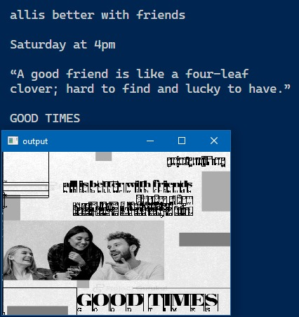
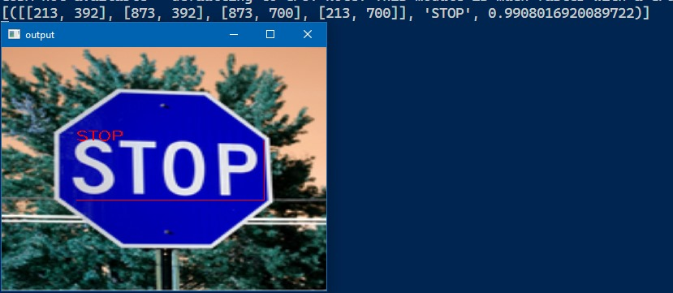

# OCR Project

Welcome to the OCR (Optical Character Recognition) project! This repository contains tools to detect text from images, videos, and real-time feeds using Tesseract and EasyOCR.

## Overview

The OCR project leverages Tesseract and EasyOCR to extract text from various sources such as images, videos, and real-time camera feeds. Tesseract provides an accuracy of around 90%, while EasyOCR offers an accuracy of approximately 80%.

## Features

- **Text Detection from Images**: Extracts text from static images.
- **Text Detection from Videos**: Processes video files to detect and extract text.
- **Real-Time Text Detection**: Captures real-time video feed from a camera to detect and extract text.
- **High Accuracy**: Achieves around 90% accuracy with Tesseract and around 80% accuracy with EasyOCR.
- **Easy to Use**: Simple scripts and easy-to-follow instructions.

## Installation

1. Clone the repository:
   ```bash
   git clone https://github.com/Zzabi/OCR.git
   cd OCR
   ```

2. Create and activate a virtual environment:
   ```bash
   conda create -n ocr python=3.9.4
   conda activate ocr
   ```

3. Install the required packages:
   ```bash
   pip install -r requirements.txt
   ```

4. Install Tesseract:
   Download and install Tesseract from [here](https://tesseract-ocr.github.io/tessdoc/Installation.html).

## Usage

Before running the scripts, ensure you update the paths for Tesseract executable, image files, and video files.

1. **Text Detection from Images**:
   - Update the path to Tesseract executable and the path to the image file in the script.
   - Run the script:
     ```bash
     python Img_to_text_tesseract.py # for tesseract
     python Img_to_text_easyocr.py # for tesseract
     ```

2. **Text Detection from Videos**:
   - Update the path to Tesseract executable and the path to the video file in the script.
   - Run the script:
     ```bash
     python video.py # uses tesseract
     ```

3. **Real-Time Text Detection**:
   - Update the path to Tesseract executable in the script.
   - Run the script:
     ```bash
     python realtime.py # uses tesseract
     ```

## Results


